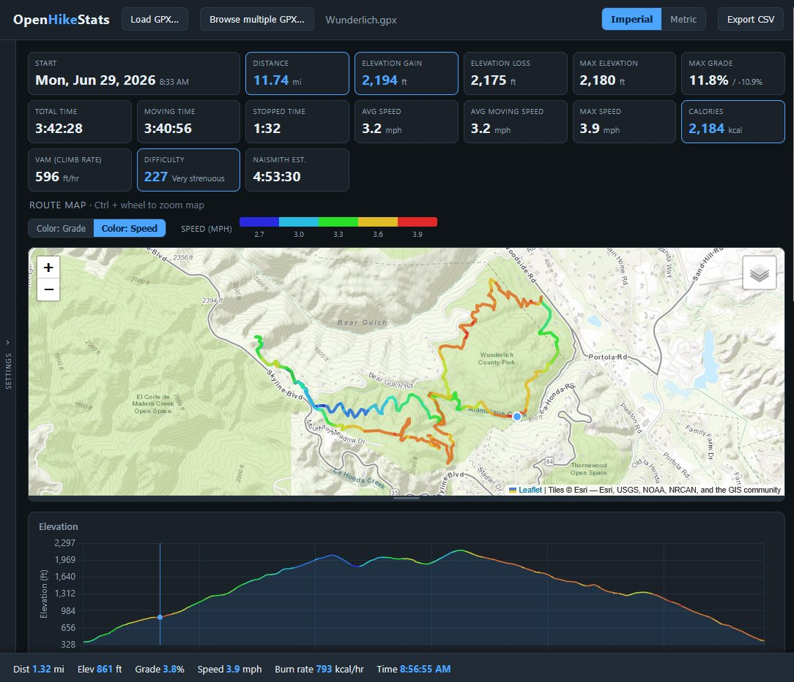
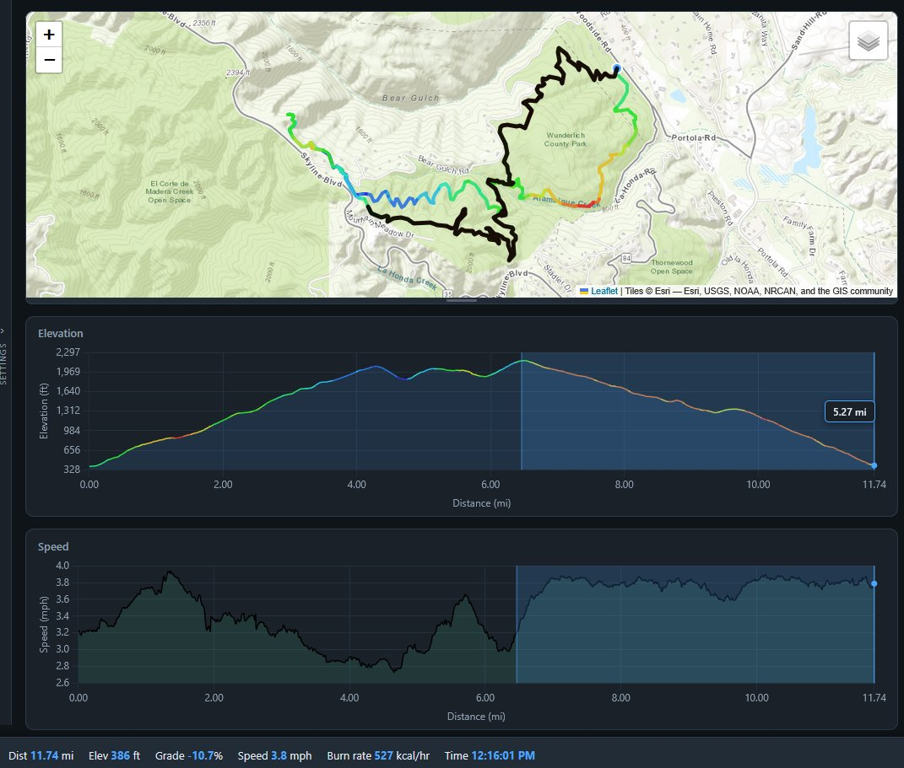
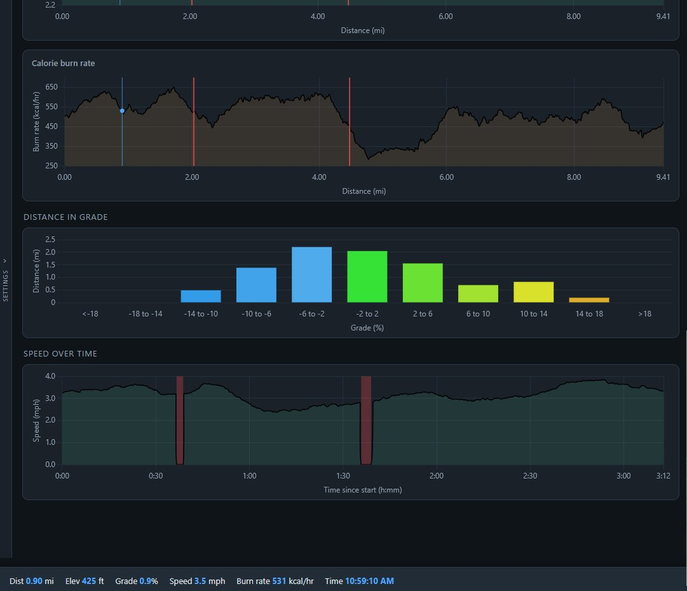
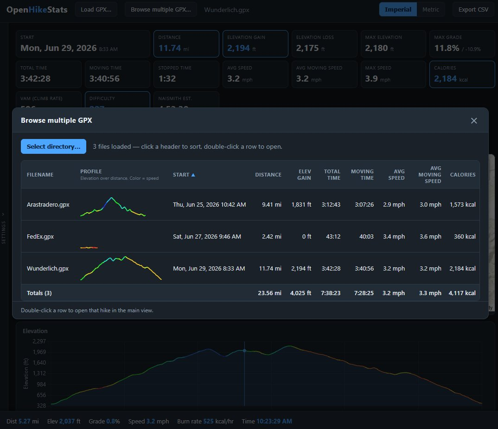

# OpenHikeStats
Open source single-page web app to analyze GPX files created while hiking.  Browse a whole directory to see elevation/distance profiles for each GPX file in the directory.  Created entirely with Claude Code.

